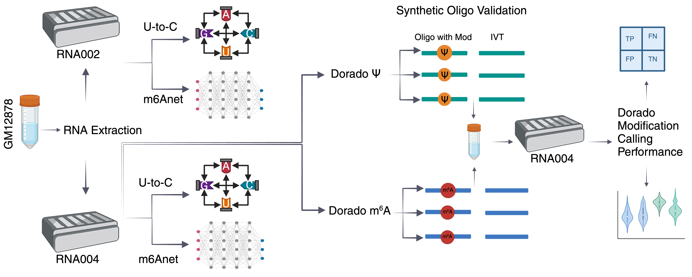

# **Evaluation of Nanopore direct RNA sequencing updates for modification detection**



## Abstract
Nanopore technology can directly sequence intact RNA molecules, offering a unique capability to read native modifications. Oxford Nanopore Technologies recently updated its direct RNA sequencing technology (DRS) from RNA002 to RNA004 chemistry. This update included an improved basecaller (Dorado) for increased sequencing accuracy, and ionic current models for de novo detection of eight RNA modifications. We compared RNA002 and RNA004 platforms using RNA from GM12878 B-lymphocyte cell line and evaluated Dorado modification calling accuracy. We computed U-to-C mismatches, previously used to identify putative pseudouridine sites, and ran m6anet for identifying putative N6-methyladenosine sites. Dorado results for each respective modification showed both global and site-specific differences when compared to RNA002 results. We used DRS data from in vitro transcription of GM12878 genomic DNA as well as synthetic oligonucleotides to evaluate Dorado modification calling performance. Dorado’s pseudouridine model achieved 96–98% for both accuracy and F1-score. Similarly, Dorado’s N6-methyladenosine model achieved 94–98% accuracy, 96–99% F1-score. Our results demonstrate that Nanopore DRS could simultaneously detect pseudouridine, N6-methyladenosine, 5-methylcytosine, and inosine modifications on individual mRNA strands. We propose a series of curation criteria for stratifying DRS-based modification calls. These criteria include read coverage, modification occupancy, canonical RNA-based false positive correction, synthetic RNA-based validation, and comparison with orthogonal information. These filtering steps result in a substantial reduction in putative modification calls. We also sequenced RNA from HEK293 cells and compared Dorado modification calls against orthogonal datasets derived for the same cell line. We noted significant discordance between known orthogonal information and DRS-based modification calls. We also documented disagreements between orthogonal datasets themselves. It is critical to validate modification calls using both Nanopore DRS and robust orthogonal methods for increased confidence. 

**Keywords: Direct RNA Sequencing, RNA Modification, Nanopore Sequencing, Modification Calling Performance**


## Overview

This repository contain all the codebase and examplelar data from the paper.
Each folder contains the notebooks for each of spesific figure panel.
The sequence level generated data are publicly available at AWS (see the paper).

## Repository Structure

```

RNA002_vs_RNA004/
├── Exemplar_Data    # All examplar data filres
│   ├── example RNA002 bam
│   ├── example RNA004 bam
│   ├── example Modkit file
│   ├── example Pysamstats file
│   └── example M6anet file
├── Figure_1/      # Comparison of RNA002 and RNA004 direct RNA sequencing performance.
│   ├── figure1a.ipynb
│   ├── figure1b.ipynb
│   ├── figure1c.ipynb
│   ├── figure1d.ipynb
│   └── figure1e.ipynb
├── Figure_2/      # Comparison of Dorado Ψ and m6A models with the RNA002 modification calling strategies.
│   ├── figure2a.ipynb
│   ├── figure2b.ipynb
│   ├── figure2c.ipynb
│   ├── figure2d.ipynb
│   ├── figure2e.ipynb
│   ├── figure2f.ipynb
│   ├── figure2g.ipynb
│   └── figure2h.ipynb
├── Figure_3/      # Adjusting false positive rates for modification calls using genomic DNA-based, IVT-derived canonical RNA.
│   ├── figure3a.png
│   ├── figure3b.ipynb
│   └── figure3c.ipynb
├── Figure_4/      # Evaluation of Dorado modification calling performance on known synthetic modification-bearing and canonical IVT oligonucleotides.
│   ├── figure4a.ipynb
│   ├── figure4b.ipynb
│   ├── figure4c.ipynb
│   ├── figure4d.ipynb
│   ├── figure4e.ipynb
│   └── figure4f.ipynb
├── Figure_5/      # Co-occurrence of multiple RNA modifications
│   ├──
│   ├──
│   ├──
│   ├──
│   ├──
│   └──
├── Figure_6/      # Comparison of Dorado modification calls with orthogonal datasets
│   ├──
│   ├──
│   ├──
│   ├──
│   ├──
│   └──
└── README.md

```


## Citation

```
doi: https://doi.org/10.1101/2025.05.01.651717

```